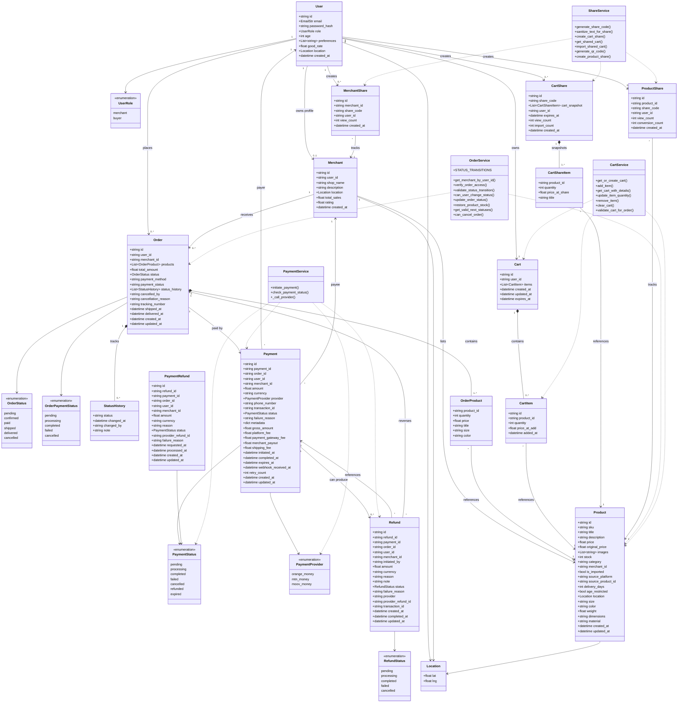

# Backend UML Class Diagram

This is a UML-style class diagram (Mermaid classDiagram) for core backend domain models and key services.

```mermaid
classDiagram

class UserRole {
  <<enumeration>>
  merchant
  buyer
}

class OrderStatus {
  <<enumeration>>
  pending
  confirmed
  paid
  shipped
  delivered
  cancelled
}

class OrderPaymentStatus {
  <<enumeration>>
  pending
  processing
  completed
  failed
  cancelled
}

class PaymentStatus {
  <<enumeration>>
  pending
  processing
  completed
  failed
  cancelled
  refunded
  expired
}

class PaymentProvider {
  <<enumeration>>
  orange_money
  mtn_money
  moov_money
}

class RefundStatus {
  <<enumeration>>
  pending
  processing
  completed
  failed
  cancelled
}

class Location {
  +float lat
  +float lng
}

class User {
  +string id
  +EmailStr email
  +string password_hash
  +UserRole role
  +int age
  +List~string~ preferences
  +float good_rate
  +Location location
  +datetime created_at
}

class Merchant {
  +string id
  +string user_id
  +string shop_name
  +string description
  +Location location
  +float total_sales
  +float rating
  +datetime created_at
}

class Product {
  +string id
  +string sku
  +string title
  +string description
  +float price
  +float original_price
  +List~string~ images
  +int stock
  +string category
  +string merchant_id
  +bool is_imported
  +string source_platform
  +string source_product_id
  +int delivery_days
  +bool age_restricted
  +Location location
  +string size
  +string color
  +float weight
  +string dimensions
  +string material
  +datetime created_at
  +datetime updated_at
}

class StatusHistory {
  +string status
  +datetime changed_at
  +string changed_by
  +string note
}

class OrderProduct {
  +string product_id
  +int quantity
  +float price
  +string title
  +string size
  +string color
}

class Order {
  +string id
  +string user_id
  +string merchant_id
  +List~OrderProduct~ products
  +float total_amount
  +OrderStatus status
  +string payment_method
  +string payment_status
  +List~StatusHistory~ status_history
  +string cancelled_by
  +string cancellation_reason
  +string tracking_number
  +datetime shipped_at
  +datetime delivered_at
  +datetime created_at
  +datetime updated_at
}

class CartItem {
  +string id
  +string product_id
  +int quantity
  +float price_at_add
  +datetime added_at
}

class Cart {
  +string id
  +string user_id
  +List~CartItem~ items
  +datetime created_at
  +datetime updated_at
  +datetime expires_at
}

class CartShareItem {
  +string product_id
  +int quantity
  +float price_at_share
  +string title
}

class CartShare {
  +string id
  +string share_code
  +List~CartShareItem~ cart_snapshot
  +string user_id
  +datetime expires_at
  +int view_count
  +int import_count
  +datetime created_at
}

class ProductShare {
  +string id
  +string product_id
  +string share_code
  +string user_id
  +int view_count
  +int conversion_count
  +datetime created_at
}

class MerchantShare {
  +string id
  +string merchant_id
  +string share_code
  +string user_id
  +int view_count
  +datetime created_at
}

class Payment {
  +string id
  +string payment_id
  +string order_id
  +string user_id
  +string merchant_id
  +float amount
  +string currency
  +PaymentProvider provider
  +string phone_number
  +string transaction_id
  +PaymentStatus status
  +string failure_reason
  +dict metadata
  +float gross_amount
  +float platform_fee
  +float payment_gateway_fee
  +float merchant_payout
  +float shipping_fee
  +datetime initiated_at
  +datetime completed_at
  +datetime expires_at
  +datetime webhook_received_at
  +int retry_count
  +datetime created_at
  +datetime updated_at
}

class PaymentRefund {
  +string id
  +string refund_id
  +string payment_id
  +string order_id
  +string user_id
  +string merchant_id
  +float amount
  +string currency
  +string reason
  +PaymentStatus status
  +string provider_refund_id
  +string failure_reason
  +datetime requested_at
  +datetime processed_at
  +datetime created_at
  +datetime updated_at
}

class Refund {
  +string id
  +string refund_id
  +string payment_id
  +string order_id
  +string user_id
  +string merchant_id
  +string initiated_by
  +float amount
  +string currency
  +string reason
  +string note
  +RefundStatus status
  +string failure_reason
  +string provider
  +string provider_refund_id
  +string transaction_id
  +datetime created_at
  +datetime completed_at
  +datetime updated_at
}

class OrderService {
  +STATUS_TRANSITIONS
  +get_merchant_by_user_id()
  +verify_order_access()
  +validate_status_transition()
  +can_user_change_status()
  +update_order_status()
  +restore_product_stock()
  +get_valid_next_statuses()
  +can_cancel_order()
}

class CartService {
  +get_or_create_cart()
  +add_item()
  +get_cart_with_details()
  +update_item_quantity()
  +remove_item()
  +clear_cart()
  +validate_cart_for_order()
}

class ShareService {
  +generate_share_code()
  +sanitize_text_for_share()
  +create_cart_share()
  +get_shared_cart()
  +import_shared_cart()
  +generate_qr_code()
  +create_product_share()
}

class PaymentService {
  +initiate_payment()
  +check_payment_status()
  +_call_provider()
}

User --> UserRole
User --> Location
Merchant --> Location
Product --> Location
Order --> OrderStatus
Order --> OrderPaymentStatus
Payment --> PaymentStatus
Payment --> PaymentProvider
PaymentRefund --> PaymentStatus
Refund --> RefundStatus

User "1" --> "0..1" Merchant : owns profile
Merchant "1" --> "0..*" Product : lists
User "1" --> "0..*" Order : places
Merchant "1" --> "0..*" Order : receives

Order "1" *-- "1..*" OrderProduct : contains
Order "1" *-- "0..*" StatusHistory : tracks
OrderProduct "*" --> "1" Product : references

User "1" --> "1" Cart : owns
Cart "1" *-- "0..*" CartItem : contains
CartItem "*" --> "1" Product : references

User "1" --> "0..*" CartShare : creates
CartShare "1" *-- "1..*" CartShareItem : snapshots
CartShareItem "*" --> "1" Product : references

User "1" --> "0..*" ProductShare : creates
ProductShare "*" --> "1" Product : tracks
User "1" --> "0..*" MerchantShare : creates
MerchantShare "*" --> "1" Merchant : tracks

Order "1" --> "0..1" Payment : paid by
Payment "*" --> "1" User : payer
Payment "*" --> "1" Merchant : payee
Payment "1" --> "0..*" Refund : can produce
Refund "*" --> "1" Payment : references
Refund "*" --> "1" Order : reverses

OrderService ..> Order
OrderService ..> Product
CartService ..> Cart
CartService ..> CartItem
CartService ..> Product
ShareService ..> CartShare
ShareService ..> ProductShare
ShareService ..> MerchantShare
PaymentService ..> Payment
PaymentService ..> Refund
PaymentService ..> PaymentProvider
PaymentService ..> PaymentStatus
```
