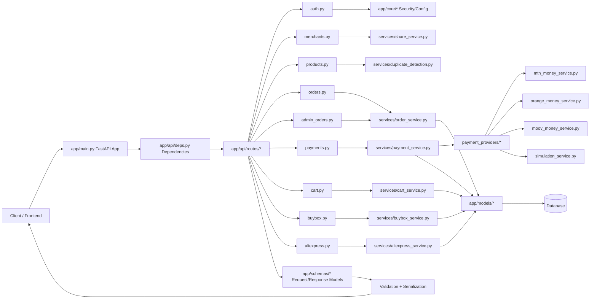

# Backend Request Flow Diagram

This file focuses on backend request flow from API routes to services and data models.

```mermaid
flowchart LR
    Client[Client / Frontend] --> Main[app/main.py FastAPI App]
    Main --> Deps[app/api/deps.py Dependencies]
    Deps --> Routes[app/api/routes/*]

    Routes --> AuthR[auth.py]
    Routes --> MerchantR[merchants.py]
    Routes --> ProductR[products.py]
    Routes --> OrderR[orders.py]
    Routes --> AdminOrderR[admin_orders.py]
    Routes --> PaymentR[payments.py]
    Routes --> CartR[cart.py]
    Routes --> BuyboxR[buybox.py]
    Routes --> AliR[aliexpress.py]

    AuthR --> Core[app/core/* Security/Config]

    MerchantR --> MerchantSvc[services/share_service.py]
    ProductR --> ProductSvc[services/duplicate_detection.py]

    OrderR --> OrderSvc[services/order_service.py]
    AdminOrderR --> OrderSvc
    CartR --> CartSvc[services/cart_service.py]

    PaymentR --> PaymentSvc[services/payment_service.py]
    PaymentSvc --> ProviderRouter[payment_providers/*]
    ProviderRouter --> MTN[mtn_money_service.py]
    ProviderRouter --> Orange[orange_money_service.py]
    ProviderRouter --> Moov[moov_money_service.py]
    ProviderRouter --> Sim[simulation_service.py]

    BuyboxR --> BuyboxSvc[services/buybox_service.py]
    AliR --> AliSvc[services/aliexpress_service.py]

    OrderSvc --> Models[app/models/*]
    CartSvc --> Models
    PaymentSvc --> Models
    BuyboxSvc --> Models
    AliSvc --> Models

    Routes --> Schemas[app/schemas/* Request/Response Models]
    Schemas --> Validation[Validation + Serialization]

    Models --> DB[(Database)]
    Validation --> Client
```
