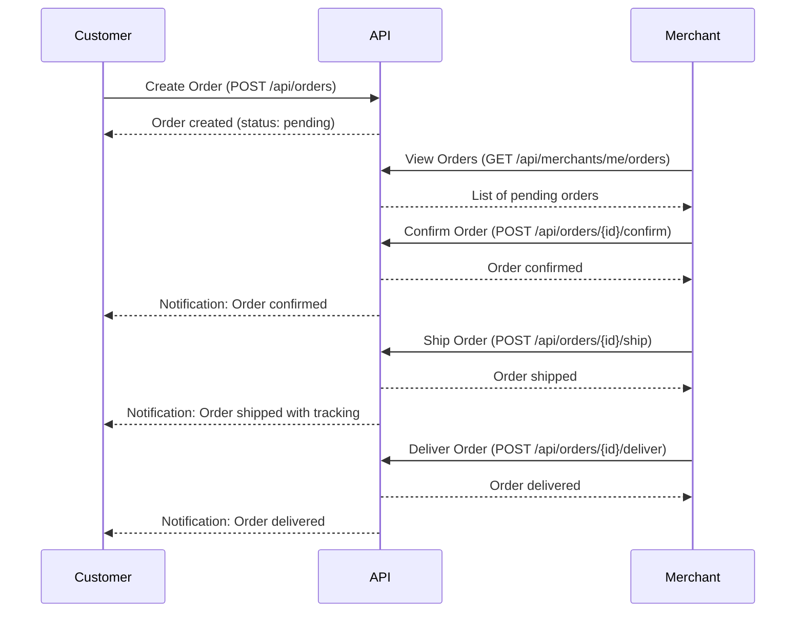
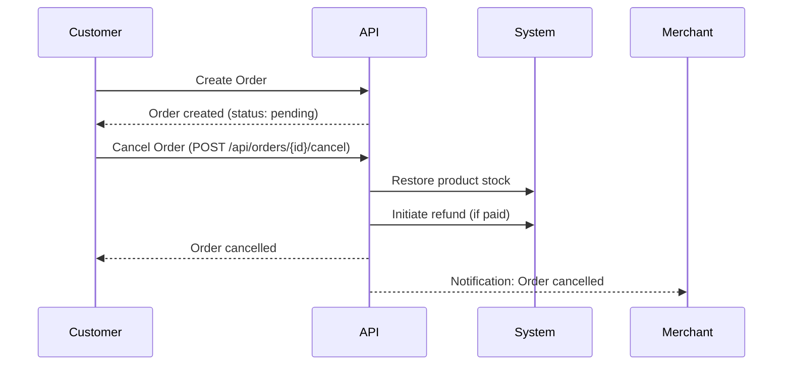
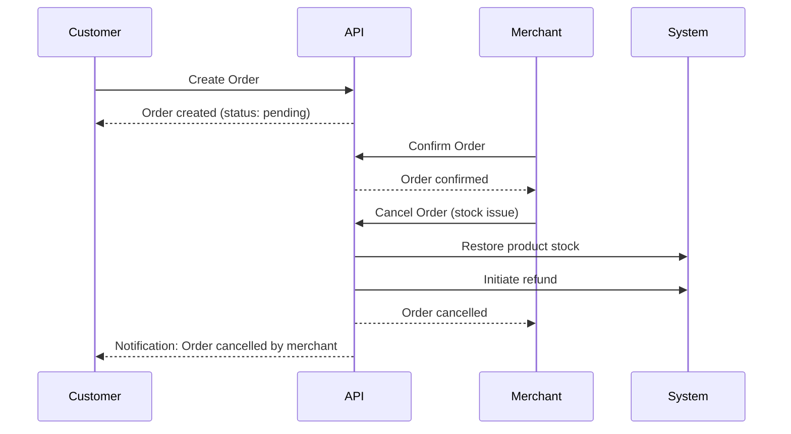

# Order Management System - API Usage Guide

## Overview
This guide demonstrates how to use the new order management endpoints in the Alia backend API.

## Table of Contents
1. [Role-Based Order Viewing](#role-based-order-viewing)
2. [Merchant Order Management](#merchant-order-management)
3. [Order Status Transitions](#order-status-transitions)
4. [Complete Order Lifecycle](#complete-order-lifecycle)

---

## Role-Based Order Viewing

### Customer View: Get My Orders
**Endpoint:** `GET /api/orders`
**Authorization:** Bearer token (customer/buyer)

```bash
curl -X GET "http://localhost:8000/api/orders?status=pending&limit=20&offset=0" \
  -H "Authorization: Bearer <customer_token>"
```

**Response:**
```json
{
  "orders": [
    {
      "id": "order_id_123",
      "user_id": "customer_id",
      "merchant_id": "merchant_id",
      "products": [...],
      "total_amount": 92000,
      "status": "pending",
      "payment_method": "orange_money",
      "created_at": "2025-12-30T00:00:00Z",
      "updated_at": "2025-12-30T00:00:00Z"
    }
  ],
  "total": 5,
  "limit": 20,
  "offset": 0
}
```

### Merchant View: Get Orders I Received
**Endpoint:** `GET /api/merchants/me/orders`
**Authorization:** Bearer token (merchant)

```bash
curl -X GET "http://localhost:8000/api/merchants/me/orders?status=pending&limit=20&offset=0" \
  -H "Authorization: Bearer <merchant_token>"
```

**Response:** Same structure as above, but shows orders where merchant is the recipient.

---

## Merchant Order Management

### 1. Confirm Order
**Endpoint:** `POST /api/orders/{order_id}/confirm`
**Authorization:** Bearer token (merchant only)
**Prerequisite:** Order must be in `pending` status

```bash
curl -X POST "http://localhost:8000/api/orders/order_id_123/confirm" \
  -H "Authorization: Bearer <merchant_token>" \
  -H "Content-Type: application/json" \
  -d '{
    "note": "Order confirmed, preparing for shipment"
  }'
```

**Response:**
```json
{
  "message": "Order confirmed",
  "order_id": "order_id_123",
  "status": "confirmed"
}
```

### 2. Ship Order
**Endpoint:** `POST /api/orders/{order_id}/ship`
**Authorization:** Bearer token (merchant only)
**Prerequisite:** Order must be in `confirmed` status

```bash
curl -X POST "http://localhost:8000/api/orders/order_id_123/ship" \
  -H "Authorization: Bearer <merchant_token>" \
  -H "Content-Type: application/json" \
  -d '{
    "tracking_number": "TRACK123456",
    "carrier": "DHL Express",
    "note": "Shipped via DHL"
  }'
```

**Response:**
```json
{
  "message": "Order marked as shipped",
  "order_id": "order_id_123",
  "status": "shipped",
  "tracking_number": "TRACK123456",
  "shipped_at": "2025-12-30T10:30:00Z"
}
```

### 3. Mark as Delivered
**Endpoint:** `POST /api/orders/{order_id}/deliver`
**Authorization:** Bearer token (merchant only)
**Prerequisite:** Order must be in `shipped` status

```bash
curl -X POST "http://localhost:8000/api/orders/order_id_123/deliver" \
  -H "Authorization: Bearer <merchant_token>" \
  -H "Content-Type: application/json" \
  -d '{
    "note": "Successfully delivered to customer"
  }'
```

**Response:**
```json
{
  "message": "Order marked as delivered",
  "order_id": "order_id_123",
  "status": "delivered",
  "delivered_at": "2025-12-30T15:45:00Z"
}
```

---

## Order Status Transitions

### Valid Status Transitions

```
pending → confirmed (merchant only)
pending → cancelled (customer or merchant)

confirmed → shipped (merchant only)
confirmed → cancelled (merchant only)

shipped → delivered (merchant only)
shipped → [cannot cancel]

delivered → [final state]
cancelled → [final state]
```

### Cancel Order
**Endpoint:** `POST /api/orders/{order_id}/cancel`
**Authorization:** Bearer token (customer or merchant)
**Rules:**
- Customer can cancel if status is `pending`
- Merchant can cancel if status is `pending` or `confirmed`
- Cannot cancel if status is `shipped` or `delivered`

```bash
# Customer cancelling pending order
curl -X POST "http://localhost:8000/api/orders/order_id_123/cancel" \
  -H "Authorization: Bearer <customer_token>" \
  -H "Content-Type: application/json" \
  -d '{
    "reason": "Changed my mind",
    "details": "Found a better deal elsewhere"
  }'
```

```bash
# Merchant cancelling confirmed order
curl -X POST "http://localhost:8000/api/orders/order_id_123/cancel" \
  -H "Authorization: Bearer <merchant_token>" \
  -H "Content-Type: application/json" \
  -d '{
    "reason": "Product out of stock",
    "details": "The requested item is temporarily unavailable"
  }'
```

**Response:**
```json
{
  "message": "Order cancelled successfully",
  "order_id": "order_id_123",
  "status": "cancelled",
  "cancelled_by": "merchant",
  "reason": "Product out of stock"
}
```

**Side Effects:**
- Product stock is restored
- Payment refund is initiated (if payment was completed)
- Both parties receive notification

### Update Order Status (Generic)
**Endpoint:** `PATCH /api/orders/{order_id}/status`
**Authorization:** Bearer token
**Note:** This is the generic endpoint; use specific endpoints above for better UX

```bash
curl -X PATCH "http://localhost:8000/api/orders/order_id_123/status" \
  -H "Authorization: Bearer <merchant_token>" \
  -H "Content-Type: application/json" \
  -d '{
    "status": "shipped",
    "tracking_number": "TRACK123456",
    "note": "Order shipped"
  }'
```

---

## Complete Order Lifecycle

### Scenario 1: Successful Order Fulfillment



**Step-by-step:**

1. **Customer creates order** → Status: `pending`
2. **Merchant confirms order** → Status: `confirmed`
3. **Merchant ships order** → Status: `shipped` (with tracking number)
4. **Merchant marks as delivered** → Status: `delivered` (final)

### Scenario 2: Customer Cancels Pending Order



### Scenario 3: Merchant Cancels Confirmed Order



---

## Get Order Status History

**Endpoint:** `GET /api/orders/{order_id}/history`
**Authorization:** Bearer token (customer or merchant with access)

```bash
curl -X GET "http://localhost:8000/api/orders/order_id_123/history" \
  -H "Authorization: Bearer <token>"
```

**Response:**
```json
{
  "order_id": "order_id_123",
  "current_status": "delivered",
  "history": [
    {
      "status": "pending",
      "changed_at": "2025-12-30T00:00:00Z",
      "changed_by": "system",
      "note": "Order created"
    },
    {
      "status": "confirmed",
      "changed_at": "2025-12-30T01:15:00Z",
      "changed_by": "merchant_id_456",
      "note": "Order confirmed, preparing for shipment"
    },
    {
      "status": "shipped",
      "changed_at": "2025-12-30T10:30:00Z",
      "changed_by": "merchant_id_456",
      "note": "Shipped via DHL, tracking: TRACK123456"
    },
    {
      "status": "delivered",
      "changed_at": "2025-12-30T15:45:00Z",
      "changed_by": "merchant_id_456",
      "note": "Successfully delivered to customer"
    }
  ]
}
```

---

## Enhanced Merchant Dashboard

**Endpoint:** `GET /api/merchants/{merchant_id}/dashboard`
**Authorization:** Bearer token (merchant)

**New Fields Added:**
```json
{
  "merchant_id": "merchant_id_456",
  "shop_name": "Tech Store",
  "orders_count": 45,
  "revenue": 1500000,
  
  "orders_by_status": {
    "pending": 5,
    "confirmed": 3,
    "shipped": 2,
    "delivered": 30,
    "cancelled": 5
  },
  
  "recent_orders": [
    {
      "id": "order_id_123",
      "total_amount": 92000,
      "status": "pending",
      "created_at": "2025-12-30T00:00:00Z"
    },
    ...
  ],
  
  "pending_orders_count": 5,
  ...
}
```

---

## Error Handling

### Invalid Status Transition
```json
{
  "detail": "Cannot transition from 'pending' to 'delivered'. Valid transitions: confirmed, cancelled"
}
```

### Insufficient Permissions
```json
{
  "detail": "Only merchants can ship orders"
}
```

### Missing Required Field
```json
{
  "detail": "Tracking number is required when shipping an order"
}
```

### Order Not Found
```json
{
  "detail": "Order not found"
}
```

---

## Testing Checklist

- [ ] Customer can view their own orders
- [ ] Merchant can view orders they received
- [ ] Merchant can confirm pending orders
- [ ] Merchant can ship confirmed orders with tracking
- [ ] Merchant can mark shipped orders as delivered
- [ ] Customer can cancel pending orders
- [ ] Merchant can cancel pending/confirmed orders
- [ ] Cannot cancel shipped orders
- [ ] Status history is tracked correctly
- [ ] Stock is restored on cancellation
- [ ] Invalid transitions are rejected
- [ ] Unauthorized access is blocked
- [ ] Merchant dashboard shows order statistics

---

## Integration Points (TODO)

### 1. Notification System
When order status changes, send notifications to:
- Customer: Order confirmed, shipped (with tracking), delivered
- Merchant: New order received, order cancelled by customer

### 2. Payment System
When order is cancelled after payment:
- Trigger refund via payment provider
- Update order with refund status
- Send confirmation to customer

### 3. Stock Management
- `pending`: Soft stock reservation (optional)
- `confirmed`: Hard stock lock
- `cancelled`: Release stock back to inventory
- `delivered`: Stock already deducted (no action)

---

## API Reference

### Base URL
```
http://localhost:8000/api
```

### Authentication
All endpoints require JWT Bearer token in Authorization header:
```
Authorization: Bearer <your_jwt_token>
```

### Endpoints Summary

| Method | Endpoint | Description | Auth |
|--------|----------|-------------|------|
| GET | `/orders` | Get orders (role-based filter) | Any |
| GET | `/orders/{id}` | Get order details | Owner/Merchant |
| GET | `/orders/{id}/history` | Get status history | Owner/Merchant |
| PATCH | `/orders/{id}/status` | Update status (generic) | Based on transition |
| POST | `/orders/{id}/confirm` | Confirm order | Merchant only |
| POST | `/orders/{id}/ship` | Ship order | Merchant only |
| POST | `/orders/{id}/deliver` | Mark delivered | Merchant only |
| POST | `/orders/{id}/cancel` | Cancel order | Customer/Merchant |
| GET | `/merchants/me/orders` | Get merchant orders | Merchant only |
| GET | `/merchants/{id}/dashboard` | Enhanced dashboard | Merchant only |

---

## Next Steps

1. **Implement notification system** for real-time updates
2. **Integrate payment refunds** when orders are cancelled
3. **Add order tracking page** for customers to view status
4. **Implement email/SMS notifications** for status changes
5. **Add merchant analytics** for order fulfillment metrics
6. **Create admin panel** for order oversight
